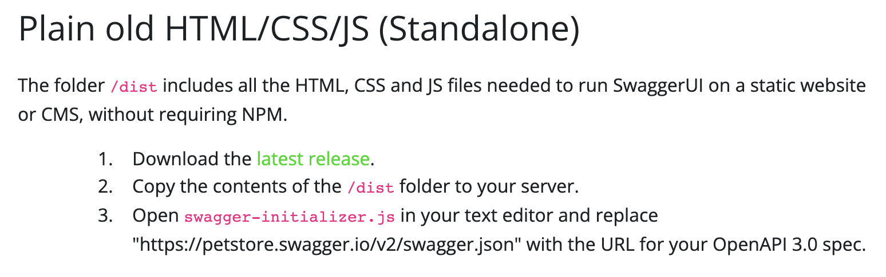
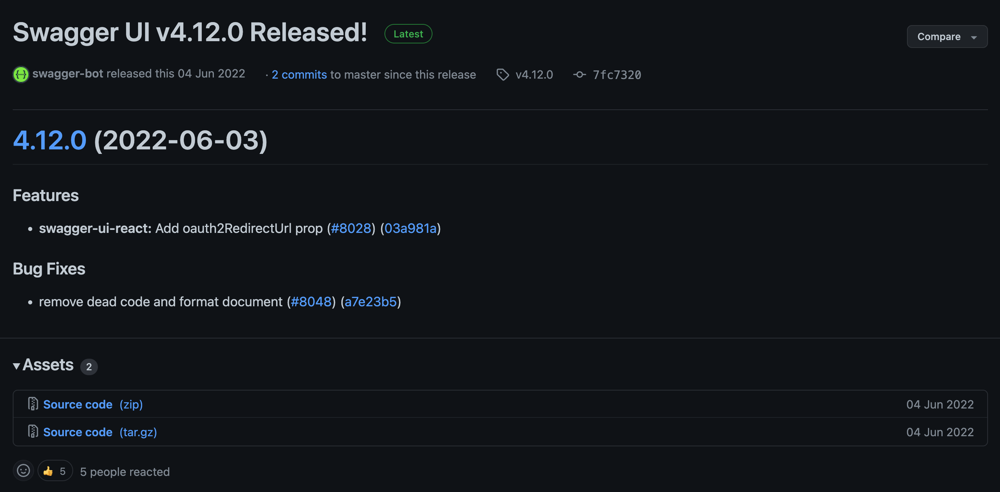
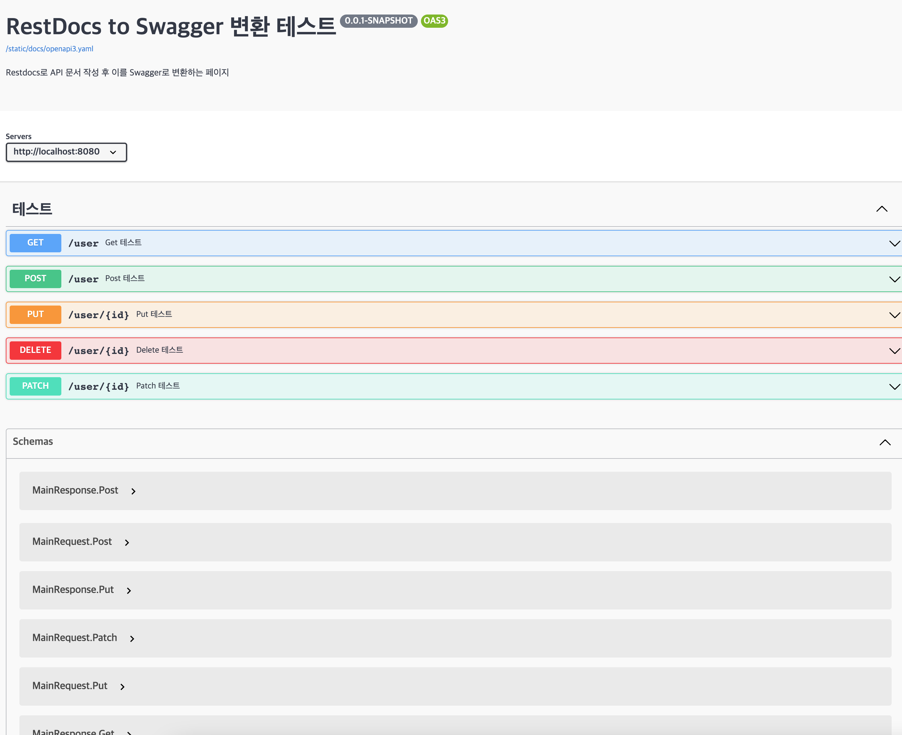

# OpenApi Spec을 이용한 Restdocs to Swagger 변환 자동화

## 프로젝트 설명
Restdocs의 경우 테스트 코드 기반으로 신뢰성 높은 API 문서를 작성할 수 있다는 장점이 있지만 API 테스트 기능이나 디자인 적인 
측면에서 Swagger에 비해 아쉬운 점이 있어 프론트와 협업시 Swagger가 더 유리하다고 판단했습니다.

이 점을 해결하기 위해 높은 신뢰성과 API를 테스트 할 수 있는 형태의 API 문서를 작성할 방법을 찾게 되었고 OpenApi Spec을 이용해
Restdocs로 작성한 테스트 코드를 Swagger로 변환할 수 있다는 점을 알게 되었습니다.

해당 프로젝트는 OpenApi Spec을 이용하여 Restdocs로 작성한 테스트를 OpenApi로 변환하여 Swagger-ui가 이를 API 문서화 시켜주는
샘플 코드를 작성했습니다.
## 개발 환경
<aside>

      🚀 언어 : Java 17

      프레임워크 : Spring boot 2.7.1

      빌드 툴 : Gradle

</aside>

## 적용 방법 
1. Gradle에 의존성 추가

   Gradle에 API 문서화와 자동 변환에 필요한 다음 의존성을 추가해주도록 합니다.

    ```groovy
    // build.gradle
    plugins {
        ...
        ...
        id 'com.epages.restdocs-api-spec' version '0.16.0'
    }
    
    dependencies {
            ...
            ...
        testImplementation 'com.epages:restdocs-api-spec-mockmvc:0.16.2'
    }
    ```

2. Open API 정보 추가하기

    ```groovy
    // build.gradle
    openapi3 {
        server = 'http://localhost:8080' // 자신 서버의 URL 작성
        title = 'RestDocs to Swagger 변환 테스트' // Swagger 작동시 페이지에 나오는 제목
        description = 'Restdocs로 API 문서 작성 후 이를 Swagger로 변환하는 페이지' // Swagger 페이지 제목 밑에 설명란에 추가되는 메세지
        version = '0.0.1-SNAPSHOT' // 애플리케이션 버전 정보
        format = 'yaml' // json으로도 가능
    }
    ```

3. 테스트 실행 후 snippet으로 생성된 openapi3.yaml 파일을 static 영역에 옮길때 사용하는 스크립트를 추가합니다.

    ```groovy
    // build.grade
    task copyTest {
        dependsOn("openapi3")
        copy {
                from "$buildDir/api-spec/openapi3.yaml"
                into "src/main/resources/static/docs/."
            }
    }
    ```

4. 이제 Swagger를 적용하기 위해 Swagger-ui를 다운받습니다.

   다운로드 링크 : [https://swagger.io/docs/open-source-tools/swagger-ui/usage/installation/](https://swagger.io/docs/open-source-tools/swagger-ui/usage/installation/)
   해당 링크에서 ****Plain old HTML/CSS/JS (Standalone)의 latest releast를 선택하여 다운할 수 있습니다.****

   

   선택하면 다음과 같은 깃허브 페이지로 이동할 수 있습니다.

   

5. 다운 받은 Swagger-ui에서 /dist 폴더 하위에 있는 파일들을 `src/main/resources/static/docs` 경로로 이동시킵니다.
6. 다운 받은 파일에서 다음 파일을 삭제합니다.
    - oauth2-redirect.html
    - swagger-ui.js
    - swagger-ui-es-bundle-core.js
    - swagger-ui-es-bundle.js
7. index.html 파일의 내용을 다음과 같이 수정합니다.

    ```html
    <!-- HTML for static distribution bundle build -->
    <!DOCTYPE html>
    <html lang="en">
    <head>
      <meta charset="UTF-8">
      <title>Swagger UI</title>
      <link rel="stylesheet" type="text/css" href="/static/docs/swagger-ui.css" />
      <link rel="icon" type="image/png" href="/static/docs/favicon-32x32.png" sizes="32x32" />
      <link rel="icon" type="image/png" href="/static/docs/favicon-16x16.png" sizes="16x16" />
      <style>
        html
        {
          box-sizing: border-box;
          overflow: -moz-scrollbars-vertical;
          overflow-y: scroll;
        }
    
        *,
        *:before,
        *:after
        {
          box-sizing: inherit;
        }
    
        body
        {
          margin:0;
          background: #fafafa;
        }
      </style>
    </head>
    
    <body>
    <div id="swagger-ui"></div>
    
    <script src="/static/docs/swagger-ui-bundle.js" charset="UTF-8"> </script>
    <script src="/static/docs/swagger-ui-standalone-preset.js" charset="UTF-8"> </script>
    <script>
      window.onload = function() {
        // Begin Swagger UI call region
        const ui = SwaggerUIBundle({
          url: "/static/docs/openapi3.yaml",
          dom_id: '#swagger-ui',
          deepLinking: true,
          presets: [
            SwaggerUIBundle.presets.apis,
            SwaggerUIStandalonePreset
          ],
          plugins: [
            SwaggerUIBundle.plugins.DownloadUrl
          ],
          layout: "StandaloneLayout"
        });
        // End Swagger UI call region
    
        window.ui = ui;
      };
    </script>
    </body>
    </html>
    ```

8. 컨트롤러를 작성하고 컨트롤러에 대한 테스트를 추가합니다.

    ```java
    @RestController
    @RequestMapping("/user")
    public class MainController {
    
        @GetMapping
        public ResponseEntity<MainResponse.Get> get() {
            return ResponseEntity.ok(
                new MainResponse.Get("get test success")
            );
        }
    }
    ```

    ```java
    @WebMvcTest(MainController.class)
    @AutoConfigureMockMvc
    @AutoConfigureRestDocs
    class MainControllerTest {
    
        @Autowired
        private MockMvc mockMvc;
    
        private final ObjectMapper mapper = new ObjectMapper();
    
        @Test
        @DisplayName("Get 테스트")
        void getTest() throws Exception {
            mockMvc.perform(
                    RestDocumentationRequestBuilders.get("/user")
                )
                .andExpect(status().isOk())
                .andDo(MockMvcRestDocumentationWrapper.document("test-get",
                    ResourceSnippetParameters.builder()
                        .tag("테스트")
                        .summary("Get 테스트")
                        .description("Get 테스트")
                        .responseSchema(Schema.schema("MainResponse.Get"))
                        ,
                    preprocessRequest(prettyPrint()),
                    preprocessResponse(prettyPrint()),
                    responseFields(
                        fieldWithPath("message").type(JsonFieldType.STRING).description("메세지")
                    )
                ));
    
        }
    }
    ```

9. static resource에 접근하기 위해 다음과 같은 설정을 스프링에 추가합니다.

    ```groovy
    @Configuration
    public class StaticRoutingConfigure implements WebMvcConfigurer {
    
        @Override
        public void addResourceHandlers(ResourceHandlerRegistry registry) {
            registry.addResourceHandler("/static/**").addResourceLocations("classpath:/static/");
        }
    }
    ```

10. 작성된 테스트를 실행한 후 build.gradle에서 작성한 copyTest를 실행시킵니다.
11. src/main/resources/static/docs/openapi3.yaml이 생성됬다면 잘 동작된 것입니다.
12. 이제 애플리케이션을 실행하고 `http://{domainname}/docs/index.html`로 이동했을 때 다음과 같은 화면이 나온다면 성공적으로 실행된 것입니다.

    

    위의 이미지는 예시로 예시 코드만 작성했다면 Get 밖에 없는 것이 정상입니다.

## 해당 프로젝트 실행방법
```shell
git clone https://github.com/zxcv9203/restdocs_swagger_openapi_spec_spmple.git open-api-spec-example
cd restdocs_open_api
gradle copyTest
gradle build
java -jar build/libs/open-api-spec-example-0.0.1-SNAPSHOT.jar
```
위의 명령 실행 후 http://localhost:8080/docs/index.html 이동하면 Swagger로 작성된 페이지를 확인할 수 있습니다.